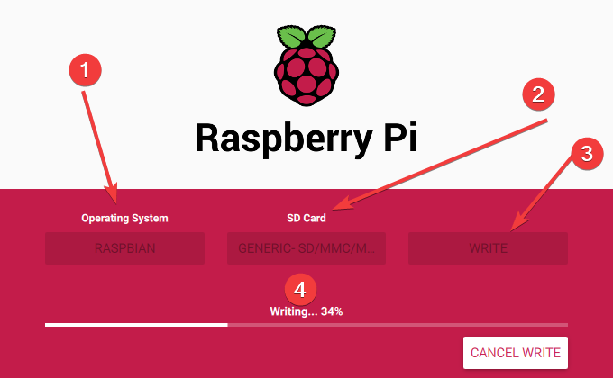
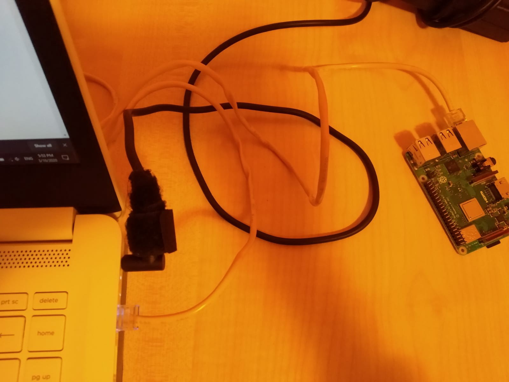
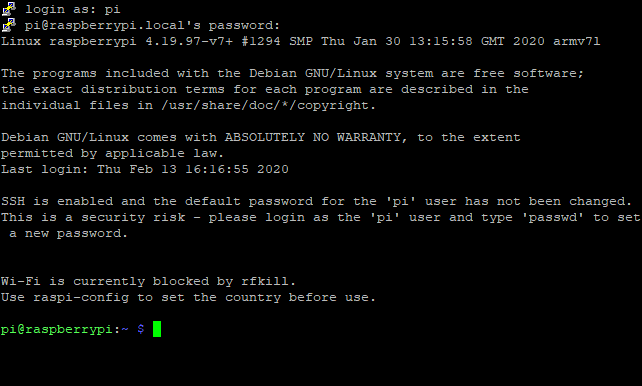
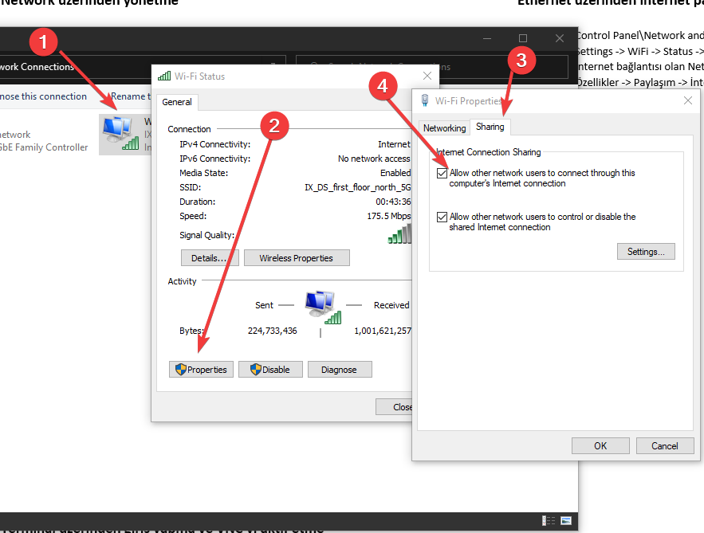
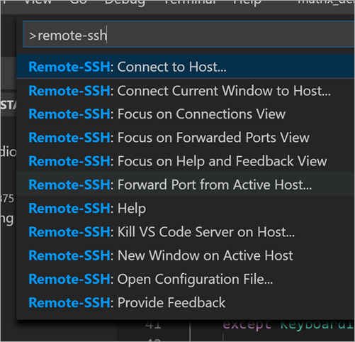

# 🍓 Raspberry Pi Kurulumu, Yönetimi ve Internet Paylaşımı

## 🏗️ Kurulum İşlemleri

* Kurulumdan önce **bilgisayarına SD kart takabiliyor** olman lazımdır
* SD kart aracı için [Hepsiburada olan bu linke](https://www.hepsiburada.com/syrox-16-gb-micro-sd-card-hafiza-karti-adaptorlu-p-HBV0000023NI9) bakabilirsin


* Resmi sitesinden [Rasbian işletim sistemi kurulum aracını](https://www.raspberrypi.org/downloads/) indirin
* SD kartınızı bilgisayarınıza takın ve **kurulum aracını** çalıştırın 1. İşletim sistemi ayarlarına ellemeyin, default olan kurulsun 2. SD kartınızı seçin \(Bu işlemden sonra SD kart silinir\) 3. Write butonu ile SD karta yazma işlemini tamamlayın

  Süreci bu aşamadan takip edebilirsiniz \(10-15dk alabilir\)

> 📢 Ubuntu core kurulması durumunda klavye, monitor veya serial cable ihtiyacınız olacaktır.


‍🧙‍♂ Detaylı bilgi için [How to login ubuntu core 18 raspberry pi 3 in headless startup](https://askubuntu.com/a/1115317/898692) alanına bakabilirsin.




## 📶 Network Üzerinden Yönetme

* SD kartı bilgisayarınıza takın
* `boot (D)` dizinine `SSH` adlı uzantısız bir dosya açın
* Bu dosya **raspberry ile bilgisayarın Ethernet üzerinden iletişime geçmesini** sağlayacaktır


## 🔌 Putty ile SSH üzerinden bağlanma



* **Ethernet** kablonuzun 1 ucunu bilgisayara diğer ucunu Raspberry Pi üzerine takın
* Windows 10 kullanıcıları için `ssh -l pi raspberrypi.local` komutu ile terminale bağlanabilirsiniz


* Yukarıdaki işlem çalışmaz ise bilgisayarınıza [Putty](https://www.chiark.greenend.org.uk/~sgtatham/putty/latest.html) uygulamasını indirin \(ücretsizdir\)
* Putty uygulamasını açın ve
  1. Host name: `raspberrypi.local`
  2. Port: `22`
  3. Ardından **Open** butonuna tıklayın \(terminal üzerinde açılacaktır\)
* Login as alanına: `pi`
* Password alanına: `raspberry`



## 🖤 Terminal üzerinden giriş yapma ve VNC'yi aktif etme

* `sudo raspi-config` komutu ile Raspberry ayarlarını açın
  * 5'inci kısımda yer alan **Interfacing Options** alanını seçin
  * Ardından **P3 VNC** kısmını seçip **YES** seçeneğine tıklayın

## 🖼 VNC ile bağlanma

* İlk olarak [VNC Viewer](https://www.realvnc.com/en/connect/download/viewer/) uygulamasını kurun
* Uygulama üzerinden **VNC server address** alanına: `raspberrypi.local`
* Bağlandıktan sonra çıkan ekranda
  * Login as alanına: `pi`
  * Password alanına: `raspberry`


## 🏠 Statik IP Adresi Verme

* Putty veya VNC Viewer üzerinden raspberrypi cihazınıza bağlanın ve terminali açın
* Bağlantı ayarlarını değiştirmek için `sudo nano /etc/dhcpcd.conf` komutunu yazın
* Yapılandırma ayarlarının **en altında yer alan** yapılandırma ayarlarını aşağıdaki gibi yapın


```text
interface wlan0

static ip_address=192.168.1.11/24
static routers=192.168.1.1
static domain_name_servers=192.168.1.1 8.8.8.8

profile static_eth0
static ip_address=192.168.0.23/24
static routers=192.168.0.1
static domain_name_servers=192.168.0.1 8.8.8.8

fallback static_eth0
```



📢 Hem `wlan0` hem de `eth0` arayüzü oluşturunca hatalı davranmakta


## 🤝 Ethernet üzerinden internet paylaşma

* **Control Panel\Network and Internet\Network Connections** alanına girin
* **Settings -&gt; WiFi -&gt; Status -&gt; Change adapter settings**
* **İnternet bağlantısı olan Network bağdaştırıcısının** üzerine sağ tıklayın
* Özellikler -&gt; Paylaşım -&gt; **İnternet paylaşımına izin ver** butonunu seçin



## 🌇 VS Code Üzerinden Yönetme

* İlk olarak [Remote SSH](https://marketplace.visualstudio.com/items?itemName=ms-vscode-remote.remote-ssh) eklentisini indirin
* ✲ Ctrl ⇧ Shift P ile komut penceresini açın ve oraya `remote-ssh` yazın
* **Connect to Host..** komutuna tıklayın
* Çıkan pencereye `pi@raspberrypi` yazın ve bağlanın
  * Bağlantı sırasında şifre ayarlamadıysanız `raspberry` şifresini kullanın
  * Eğer host name farklı ise Putty üzerinden **terminaldeki komut yazdığınız satırdaki ismi** kopyalayın



## 🔗 Faydalı Bağlantılar

* [📖 VNC \(Virtual Network Computing\)](https://www.raspberrypi.org/documentation/remote-access/vnc/README.md)
* 📃 [How to Setup Raspberry Pi Without Monitor and Keyboard](https://www.instructables.com/id/How-to-Setup-Raspberry-Pi-Without-Monitor-and-Keyb/)
* 📃 [How to Share Internet Over Ethernet Cable](https://www.instructables.com/id/How-to-share-Internet-over-Ethernet-Cable/)
* 📃 [Visual Studio Code Remote Development over SSH to a Raspberry Pi is butter](https://www.hanselman.com/blog/VisualStudioCodeRemoteDevelopmentOverSSHToARaspberryPiIsButter.aspx)
* 📃 [Raspberry Pi as Wake On Lan Ethernet Bridge](https://www.raspberrypi.org/forums/viewtopic.php?t=92977)

